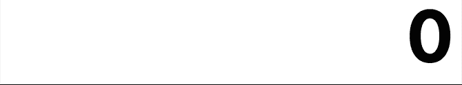

[Demo](https://shammellee.github.io/jquery-easy-number-animate)

# Requirements

* [jQuery](https://jquery.com)


# Usage

```html
<html>
  <head>
    <title>jQuery Easy Number Animate</title>
  </head>

  <body>
    <span class='number'>0</span>

    <script src='https://code.jquery.com/jquery-3.3.1.slim.min.js'></script>
    <script src='dist/jquery.easy_number_animate.js'></script>

    <script>
      $(function()
      {
        var $text = $('.number');

        var options_1 = {
          start_value: 0
          ,end_value: 1000000
          ,after: function($element, _value)
          {
            alert('final value: ' + _value);
          }
        };

        var options_2 = {
          start_value: 1000000
          ,end_value: 0
          ,duration: 5000
          ,before: function($element)
          {
            alert('About to animate');
          }
        };

        // Animate from zero to one million over one second (default), then
        // display the final value
        $text.easy_number_animate(options_1);

        // Display a message, then animate from one million to zero over five
        // seconds
        $text.easy_number_animate(options_2);
      });
    </script>
  </body>
</html>
```



# Options

Option          | Type       | Default | Description
----------------|:----------:|:-------:|------------------------------------------------------
`start_value`   | `number`   | 0       | Value to start the animation from
`end_value`     | `number`   | 100     | Value to end the animation at
`duration`      | `number`   | 1000    | Approximate duration of the animation in milliseconds
`delimiter`     | `string`   | `,`     | Delimter to use to group the number by thousands (e.g. 1,000). Set the value to a falsy value to disable delimiters.
`before`        | `function` | null    | Callback to invoke before animating the number. Passes the jQuery object whose value is being animated as the first argument.
`after`         | `function` | null    | Callback to invoke after animating the number. Passes the jQuery object whose value is being animated as the first argument and the `end_value` (`number`) as the second argument.


# TODO

* Fix rounding numbers to the nearest integer

